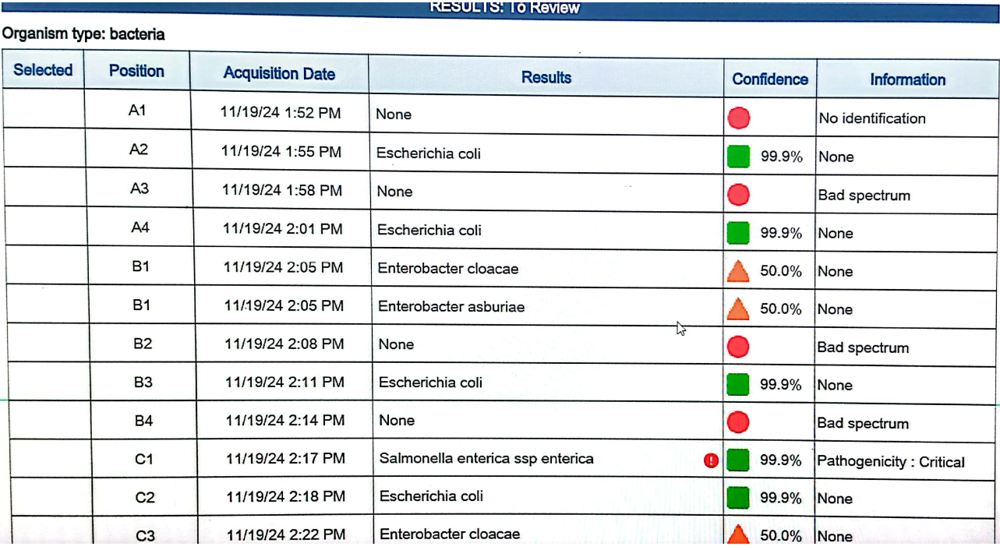
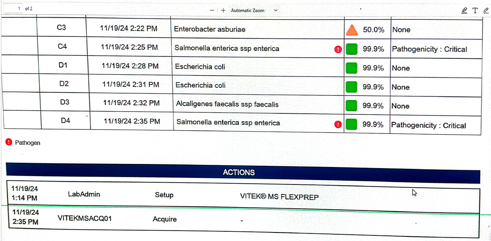

```{r setup, include=FALSE}
knitr::opts_chunk$set(echo = TRUE)
```

#course part 1 - laboratory
we selected 20 isolates
- 6 isolates are **klebsiella sp.**
- 6 isolates are ***E. coli sp.***
- 8 isolates are ***salmonella sp.***

 # sub culturing of those isolates were done on 19_11_2024

## results of isolates species identification

 <!--
 This is to view a file / image in the document when knitted (printed)
 ![integrated pdf] (files/VITECK RESULTS19_11_2024.pdf)
  -->
  
  # Out of 20 isolates 8 were identified with ***E. coli*** (8 isolates) and ***Salmonella enterica*** spp enterica (3 isolates)
 
 - some isolates could not be identifies
 - the reasons would be 
  -- no colony
  -- several strains (>2)
  -- not be able to distinguish between 2 strains
  -- mixture of 2 strains
  -- contaminated

 
  <!--I have made a link to a file -->
  [linked pdf](files/VITECK RESULTS19_11_2024.pdf)
  
 
 # picture of the results
 
 
 
 
 
 
  
  # preparing for DNA extraction on Thursday, who are responsible for which strains.
  
 E - Emanuel
 
 M - Maulid
 
 A - Anna
 
 C - Camilla


 A2 and C1 - E
 
 A4 and C4 - M
 
 B3 and D4 - A
 
 C2, D1 and D2 - C
 
 Jannice and Camilla will perform DNA extraction to 3 isolates for demonstration then as students will do the other.
 

## R Markdown

This is an R Markdown document. Markdown is a simple formatting syntax for authoring HTML, PDF, and MS Word documents. For more details on using R Markdown see <http://rmarkdown.rstudio.com>.

When you click the **Knit** button a document will be generated that includes both content as well as the output of any embedded R code chunks within the document. You can embed an R code chunk like this:

```{r cars}
summary(cars)
```

## Including Plots

You can also embed plots, for example:

```{r pressure, echo=FALSE}
plot(pressure)
```

Note that the `echo = FALSE` parameter was added to the code chunk to prevent printing of the R code that generated the plot.
